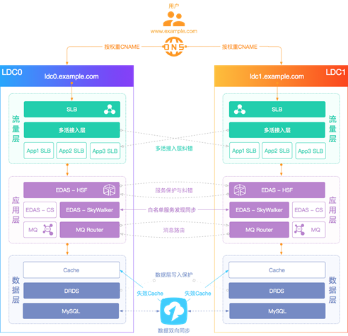

# Multi-DataCenter

## [WhatIs](WhatIs.md)

## 异地多活 (Active-Active Data Centers）

### Design
* 延时
* 数据同步
> [异地多活场景下的数据同步之道](https://www.toutiao.com/i6674164308651278859/)

### Implement
* [饿了么](implement/ele.md)

## Reference

