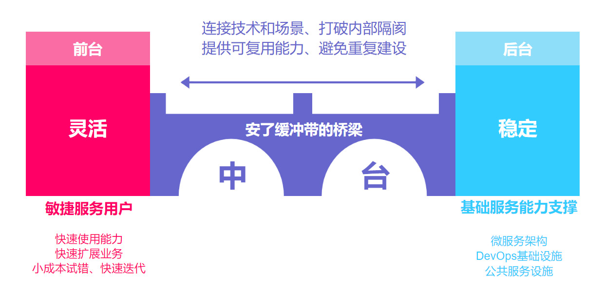

# 什么是中台？
```md
中台就是公共服务平台。
```
```md
中台不是凭空产生的，而是建立在业务之上，公司发展过程中一些项目有点不同，
然后重新搭建架构，有点资源浪费，搭建中台系统完美解决重复造轮子问题。
当然大公司才有这困惑，小公司就不用加戏了，不用盲目跟风，做好手上的事情，时间到了，风口就来了！
```
## 背景
```md
阿里中台——来自最成功游戏公司 Supercell 的启发。
Supercell的中台，指的是公司将游戏开发过程中公共和通用的游戏素材和算法整合起来，
并积累了非常科学的研发工具和框架体系，构建了一个功能非常强大的中台。
这样强大的中台可以支持若干个小团队在短时间内开发出一款新的游戏。
```
```md
在2015年年末，阿里巴巴集体进行了一次组织架构大调整，
将搜索事业部、共享业务平台、数据技术、产品部提出来，组成了“中台事业群”，并喊出“小前台，大中台”的管理模式。
```
```md
前台作为一线业务，更敏捷更快速适应市场；
中台集合整个集团的数字、运营、产品、技术能力，对各业务前台形成强力支撑。
```
## 中台解决了什么痛点？
* 痛点一：企业前方市场与企业内部支撑的冲突
```md
企业前方市场总是会趋于变化无序，而企业内部支撑总归要趋于稳定有序，两者必定冲突。
```
* 痛点二：前台与后台的冲突
```md
企业前方市场和企业内部支撑的冲突，必定带来在系统层级上的前台和后台的冲突。
```
```md
前台是对接用户的，所以系统需要快速响应前端用户的需求，快速创新、快速迭代。
简而言之，快速建设、错了就推翻重来、不能耗费太大成本。

后台是企业对内的，为了支撑前台越来越多的业务，后台不断地建设，系统不断庞大地起来。
所以后台系统需要扎实稳定，建成之后往往不能随意改动。
简而言之，是需要耗费大力成本建设的基础能力、不能轻易推翻、改动成本极大。
```
```md
前台系统和后台系统的特点决定了，两者的冲突不可避免。
```
* 痛点三：大企业的通病（各占山头、重复建设）
```md
大企业内部各处都是墙——部门墙、业务墙、数据墙。
更不用说那些一味的内部赛马的绩效考核机制，势必更加加剧部门间的相互封闭。
而一些原本可以快速提供的用户服务，却需要多重对接，无法快速拿出产品方案，耗费很大的成本和极长的时间。
一个原本可以共用的服务，被不同部门重复建设。
```
## 怎么理解中台？
```md
中台理念在冲突的企业前台和后台之间搭起桥梁。
这条桥梁，连接了技术和场景。
这条桥梁上还安了缓冲带，灵活和稳定、快和慢、低成本和高成本，都将在这里得到缓冲和过度。
这条桥梁，还能穿透企业内部封得死死的部门墙、业务墙和数据墙，将为企业生态带来不一样的新面貌。
```

```md
中台就像是一条“安了缓冲带的桥梁”，连接了灵活的前台和稳定的后台的同时，穿透了企业内部部门墙等隔阂。
它的核心是企业基础服务能力，目标是支持前台小成本地快速创新迭代，
运用后台技术手段（微服务架构、DevOps基础设施和公共服务设施等），提供可以供前台复用的公用能力。
```
## 中台类型

### 阿里中台
* 业务中台，提供重用服务，例如用户中心、订单中心之类的开箱即用可重用能力，为战场提供了空军支援能力，随叫随到，威力强大；
* 数据中台，提供数据分析能力，帮助从数据中学习改进，调整方向，为战场提供了海军支援能力；
* 算法中台，提供算法能力，帮助提供更加个性化的服务，增强用户体验，为战场提供了陆军支援能力，随机应变，所向披靡；
* 技术中台，提供自建系统部分的技术支撑能力，帮助解决基础设施，分布式数据库等底层技术问题，为前台特种兵提供了精良的武器装备；
* 研发中台，提供自建系统部分的管理和技术实践支撑能力，帮助快速搭建项目、管理进度、测试、持续集成、持续交付，是前台特种兵的训练基地；
* 组织中台，为项目提供投资管理、风险管理、资源调度等，是战场的指挥部，战争的大脑，指挥前线，调度后方。

## 中台建设原则
* 通用 标准统一，实现数据打通、可通用性。数据打通是需要整合企业内部被“部门墙”割裂的数据。
* 组件化 中台提供的服务最好以组件化的方式让业务端可以即取即用。
* 可复用 一个中台提供出的公用服务的价值高低，是“可用”和“可复用”的区别。
* 可共用 通过开放共享实现“可共用”的目标终究是中台建设的原则。
* 灵活扩展 能扛得住大流量高峰时期的高并发、高可用将成为一个大挑战。

## 所有企业都应该建设中台吗？
* 业务规模达到一定程度
* 已经实践了“系统化、中心化、平台化”
* 有魄力做组织架构重构
