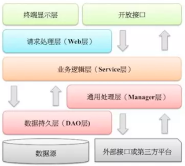
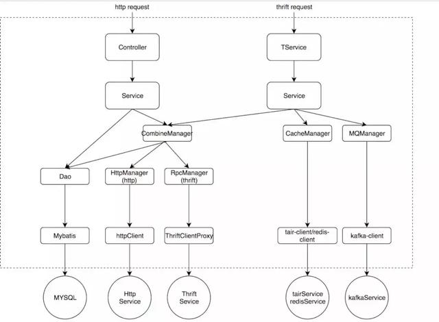
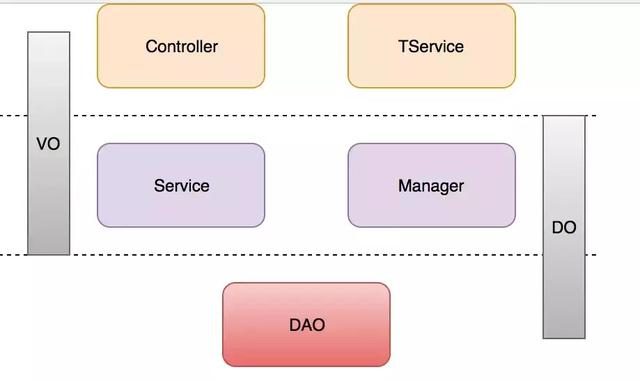

# Alibaba 开发规约-应用分层


* 开放接口层 - OpenAPI
```md
进行网关安全控制、流量控制等
```
* 终端显示层
```md
各个端的模板渲染并执行显示的层，当前主要是 velocity 渲染，JS 渲染，JSP 渲染，移动端展示等。
```
* Web 层
```md
主要是对访问控制进行转发，各类基本参数校验，或者不复用的业务简单处理等
```
* Service 层
```md
相对具体的业务逻辑服务层
```
* Manager 层
```md
通用业务处理层

特征
对第三方平台封装的层，预处理返回结果及转化异常信息
对 Service 层通用能力的下沉，如缓存方案、中间件通用处理
与 DAO 层交互，对多个 DAO 的组合复用
```
* DAO 层
```md
数据访问层，与底层 MySQL、Oracle、Hbase 等进行数据交互
```
* 外部接口或第三方平台
```md
包括其它部门 RPC 开放接口，基础平台，其它公司的 HTTP 接口
```
## 优化分层模式

```md
最上层controller和TService是阿里分层规范里面的第一层：轻业务逻辑，参数校验，异常兜底。
```

## 分层领域模型的转换
* 在阿里巴巴编码规约中列举了下面几个领域模型规约:
```md
DO（Data Object）：与数据库表结构一一对应，通过DAO层向上传输数据源对象。
DTO（Data Transfer Object）：数据传输对象，Service或Manager向外传输的对象。
BO（Business Object）：业务对象，由Service层输出的封装业务逻辑的对象。
AO（Application Object）：应用对象，在Web层与Service层之间抽象的复用对象模型，极为贴近展示层，复用度不高。
VO（View Object）：显示层对象，通常是Web向模板渲染引擎层传输的对象。
Query：数据查询对象，各层接收上层的查询请求。注意超过2个参数的查询封装，禁止使用Map类来传输。
```
* 对应关系

|   | |
| ---------- | -----------|
| Controller/TService   | VO/DTO   |
| Service/Manager       | AO/BO    |
| DAO                   | DO       |

* 缺点
```md
每一个层基本都自己对应的领域模型，这样就导致了有些人过于追求每一层都是用自己的领域模型，
这样就导致了一个对象可能会出现3次甚至4次转换在一次请求中，当返回的时候同样也会出现3-4次转换，
这样有可能一次完整的请求-返回会出现很多次对象转换。
```

* 折中的方案

```md
1. 允许Service/Manager可以操作数据领域模型，对于这个层级来说，本来自己做的工作也是做的是业务逻辑处理和数据组装。
2. Controller/TService层的领域模型不允许传入DAO层，这样就不符合职责划分了。
3. 同理，不允许DAO层的数据传入到Controller/TService。
```