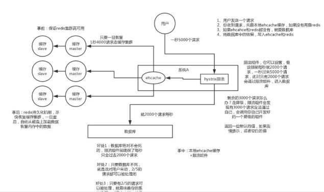

# Cache HA Puzzles

* 缓存数据一致性
```md
参考缓存数据更新
```

* 缓存并发问题

* 缓存雪崩
* 缓存穿透
* 缓存击穿

* 缓存污染
* 缓存颠簸
* 缓存无底洞现象
* 本地缓存问题

## 缓存并发
```md
是由设计不足造成的，当一个缓存key过期时，因为访问这个缓存key的请求量较大。

多个请求同时发现缓存过期，因此多个请求会同时访问数据库来查询最新数据，并且回写缓存。
这样会造成应用和数据库的负载增加，性能降低，由于并发较高，甚至会导致数据库被压死。
```
### 解决方案
* 分布式锁
```md
保证对于每个key同时只有一个线程去查询后端服务，其他线程没有获得分布式锁的权限，因此只需要等待即可。
这种方式将高并发的压力转移到了分布式锁，因此对分布式锁的考验很大。
```
* 本地锁
```md
通过本地锁的方式来限制只有一个线程去数据库中查询数据，
而其他线程只需等待，等前面的线程查询到数据后再访问缓存。
只能限制一个服务节点只有一个线程去数据库中查询，如果一个服务有多个节点，则还会有多个数据库查询操作。
```
* 软过期
```md
软过期指对缓存中的数据设置失效时间，就是不使用缓存服务提供的过期时间，
而是业务层在数据中存储过期时间信息，由业务程序判断是否过期并更新。
在发现了数据即将过期时，将缓存的时效延长，程序可以派遣一个线程去数据库中获取最新的数据
其他线程这时看到延长了的过期时间，就会继续使用旧数据，等派遣的线程获取最新数据后再更新缓存。
```
* 异步更新
```md
也可以通过异步更新服务来更新设置软过期的缓存，这样应用层就不用关心缓存并发的问题了。
```

##缓存雪崩
```md
缓存雪崩指缓存服务器重启或者大量缓存集中在某一个时间段内失效，
给后端数据库造成瞬时的负载升高的压力，甚至压垮数据库的情况。
```
### 解决方案
* 缓存的 Key 值可以取个随机值
```md		
给缓存的失效时间，加上一个随机值，避免集体失效。
例如，我们要缓存user数据
  会对每个用户的数据设置不同的缓存过期时间，可以定义一个基础时间
	假设10秒，然后加上一个两秒以内的随机数，过期时间为10～12秒，就会避免缓存雪崩。
```
* 双缓存 (多级缓存)
```md
有两个缓存，缓存 A 和缓存 B，
  缓存 A 的失效时间为 20 分钟，缓存 B 不设失效时间
  自己做缓存预热操作
		
从缓存 A 读数据库，有则直接返回
A 没有数据，直接从 B 读数据，直接返回，并且异步启动一个更新线程，更新线程同时更新缓存 A 和缓存 B。
```
* 使用互斥锁
```md
但是该方案吞吐量明显下降了
```
### 策略
```md
1. 事前
	尽量保证整个 Redis 集群的高可用性，发现机器宕机尽快补上，选择合适的内存淘汰策略
2. 事中
	本地 Ehcache 缓存 + Hystrix 限流&降级，避免 MySQL 崩掉。
3. 事后
	利用 Redis 持久化机制保存的数据尽快恢复缓存。
```


## 缓存穿透
```md
使用不存在的key进行大量的高并发查询，这导致缓存无法命中，
每次请求都要穿透到后端数据库系统进行查询，使数据库压力过大。

通常是由恶意攻击或者无意造成的。
```	
### 方案
* 约定
```md
通常将空值缓存起来，再次接收到同样的查询请求时，若命中缓存并且值为空，就会直接返回，不会透传到数据库，避免缓存穿透。
		
当然，有时恶意袭击者可以猜到我们使用了这种方案，每次都会使用不同的参数来查询，这就需要我们对输入的参数进行过滤。

例如：如果我们使用ID进行查询，则可以对ID的格式进行分析，如果不符合产生ID的规则，
    就直接拒绝或者在ID上放入时间信息，根据时间信息判断ID是否合法，
		或者是否是我们曾经生成的ID，这样可以拦截一定的无效请求。
```
```md
【缺陷】
增加我们缓存的维护成本，可以通过设置较短的超时时间来解决这个问题。
```
* 限流和熔断

* 利用互斥锁
```md
缓存失效的时候，先去获得锁，得到锁了，再去请求数据库。
没得到锁，则休眠一段时间重试。
```
* 过滤（布隆过滤器）
```md
提供一个能迅速判断请求是否有效的拦截机制
一定不存在的 Key，采用布隆过滤器，建立一个大的 Bitmap 中，查询时通过该 Bitmap 过滤。
```

## 缓存击穿
```md
一些特别热点的数据，高并发访问同一份缓存数据，导致缓存服务器压力过大。
如果某个 Key 失效，可能大量的请求打过来，缓存未命中，然后去数据库访问。
```
### 解决方案
* 复制多份缓存副本
```md
把请求分散到多个缓存服务器上，减轻缓存热点导致的单台缓存服务器压力。
```
* 异步加载
```md
由于缓存击穿是热点数据才会出现的问题，
可以对这部分热点数据采取到期自动刷新的策略，而不是到期自动淘汰。
```

## 本地缓存
### GC STW

## 缓存污染
```md
缓存污染一般出现在我们使用本地缓存中，
如 在本地缓存中如果你获得了缓存，但是你接下来修改了这个数据，这个数据却并没有更新在数据库。
```

## 缓存颠簸
```md
一般是由于缓存节点故障导致。可以看做是一种比“雪崩”更轻微的故障，但是也会在一段时间内对系统造成冲击和性能影响。
推荐的解决方案是通过一致性Hash算法来解决。
```

## 缓存无底洞现象
```md
该问题由 facebook 的工作人员提出的， facebook 在 2010 年左右，memcached 节点就已经达3000 个，缓存数千 G 内容。
他们发现了一个问题---memcached 连接频率，效率下降了，于是加 memcached 节点，
添加了后，发现因为连接频率导致的问题，仍然存在，并没有好转，称之为”无底洞现象”。
````
```md
目前主流的数据库、缓存、Nosql、搜索中间件等技术栈中，都支持“分片”技术，来满足“高性能、高并发、高可用、可扩展”等要求。
有些是在 client 端通过Hash取模（或一致性Hash）将值映射到不同的实例上，有些是在client端通过范围取值的方式映射的。当然，也有些是在服务端进行的。
但是，每一次操作都可能需要和不同节点进行网络通信来完成，实例节点越多，则开销会越大，对性能影响就越大。
```
```md
当然，缓存无底洞现象并不常见。在绝大多数的公司里可能根本不会遇到。
```
* 解决方案
```md
数据分布方式：有些业务数据可能适合Hash分布，而有些业务适合采用范围分布，这样能够从一定程度避免网络IO的开销。
IO优化：可以充分利用连接池，NIO等技术来尽可能降低连接开销，增强并发连接能力。
数据访问方式：一次性获取大的数据集，会比分多次去获取小数据集的网络IO开销更小。
```
##  总结
* 共同点：
```md
高并发
时机：缓存更新、缓存失效居多
```
* 比较
```md
 “并发”和“雪崩”都是高并发时候缓存不被命中直接访问DB的例子，但是为什么还会把他们定义为两个常见的问题？
 我的理解，前者是因，或者是果，“并发”造成的影响还不够恶劣，雪崩会导致数据库直接崩溃。
```
```md
 “并发”和“击穿”可能会导致“雪崩”发生，避免发生“雪崩”，除了给出的解决方案，更要防止“并发”和“击穿”的发生。
```
