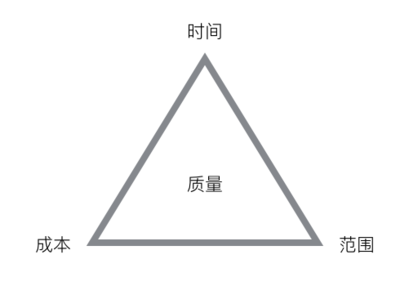

# 项目管理
```md
指按照客观规律的要求，在有限的资源条件下，运⽤系统工程的观点、理论和⽅法，
对项⽬进⾏高效率的计划、组织、指挥、控制、协调，实现⽴项时确定的⽬标。
```
```md
在项目活动中运用专门的知识、技能、工具和方法，使项目能够在有限资源限定条件下，实现或超过设定的需求和期望的过程。
```
```md
项⽬管理的要素很多，从三到四到五再到六，
项⽬管理的三要素是质量、进度、成本 ；
六要素是质量、进度、成本、范围、组织和客户满意度。
```

* 项目管理其实就是在限定的时间内，花费限定的成本，保证质量的完成规定范围的任务。

## [进度管理](Progress.md)
## [风险管理](Risk.md)


## 
* [当我们谈论“项目管理”的时候，我们到底在说什么](https://www.atatech.org/articles/78998)