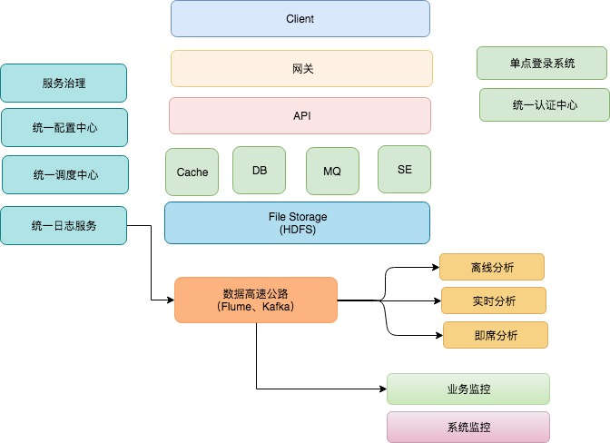

# 架构基础设施



## [Cache (缓存)](https://github.com/SunnnyChan/knowledge-Sys-of-HA/tree/master/cache)
## [Message Queue (消息队列)](https://github.com/SunnnyChan/knowledge-Sys-of-MQ)
## [Gateway 统一请求入口-API网关]
* [Load Balancer (负载均衡)](objects/load-balancer/README.md)
* API 访问权限控制
* 用户鉴权

## [Service Goverance (服务治理)](objects/service-governance/README.md)

## 业务基础服务
* [Config 统一配置中心](biz-infra/configure/README.md)
* [统一调度中心](biz-infra/scheduling/README.md)
* [Log 统一日志服务](biz-infra/log/README.md)
* [Retrieval 统一检索平台](biz-infra/log/README.md)

* [ID 生成器](biz-infra/id-generator/README.md)
* [权限管理]()
```md
shiro是apache的一个开源框架，是一个权限管理的框架，实现 用户认证、用户授权。
```

### 登录认证
* 单点登录系统
* 统一认证中心

## 数据基础设施
#### 数据存储
* 数据库
* 搜索引擎
* 文件存储

### 数据传输
* 数据高速公路

### 数据分析
* 离线数据分析
* 实时数据分析
* 数据即席分析